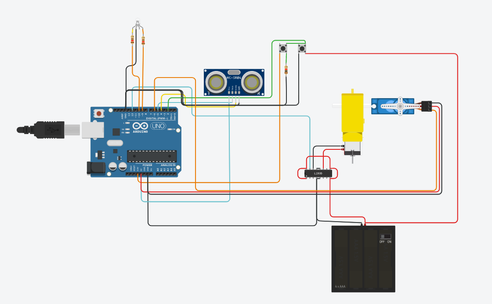

# bench-saw_safety-stop

safety-stop, This is a bench safety system design to prevent accidents. The system opperates on 2 levels

<ul>
  <li>It will give of a warning if the person is getting to close to the blade</li>
  <li>If person ignores the first warning the motor will be stoped and a break pad is launched to bring the blade a complete stop</li>
</ul>

<a href= "#" >Run simulation</a>
